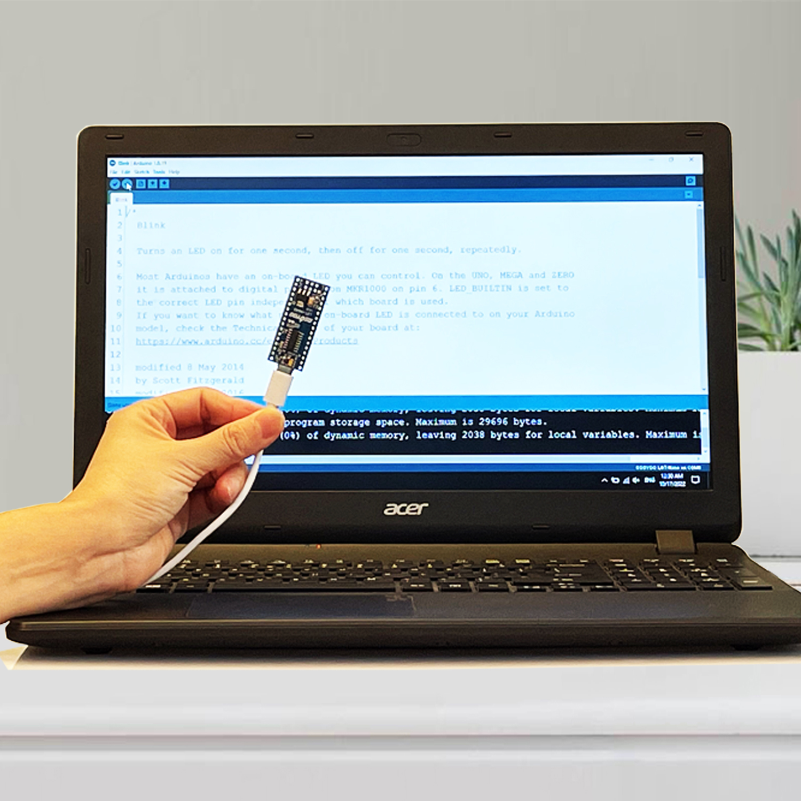

# Task 2: Basic Serial Print with Arduino

In the previous task we have seen how to blink an LED using Arduino. In this task, we will see how to print a message to the Serial Monitor using Arduino. The Serial Monitor is a tool available in the Arduino IDE that allows you to communicate with your Arduino board over a serial connection. It can be used for debugging, monitoring sensor data, and sending/receiving information between the Arduino and your computer.

Here's a basic Arduino example using `Serial.print()` to demonstrate how coding with an Arduino works. This example will show how to set up the Arduino, initialize the serial communication, and print a message to the Serial Monitor.

## Example: Basic Serial Print

#### Objective:
To introduce the basics of Arduino coding by printing a message to the Serial Monitor.



#### Components Needed:
- Arduino board (e.g., Arduino Uno)
- USB cable to connect the Arduino to your computer

#### Steps:

1. **Connect the Arduino Board:**
   - Connect your Arduino board to your computer using the USB cable.

2. **Open the Arduino IDE:**
   - Launch the Arduino IDE on your computer.

3. **Write the Code:**
   - In the Arduino IDE, write the following code:

```cpp
// Basic Serial Print Example

void setup() {
  // Initialize serial communication at 9600 bits per second:
  Serial.begin(9600);
  
  // Print a message to the Serial Monitor:
  Serial.println("Hello, Arduino!");
}

void loop() {
  // Nothing to do here
}
```

#### Code Explanation:

- **`void setup()` function:**
  - This function runs once when the Arduino is powered on or reset.
  - `Serial.begin(9600);` initializes the serial communication at a baud rate of 9600 bits per second. This sets up the communication speed between the Arduino and your computer.
  - `Serial.println("Hello, Arduino!");` sends the message "Hello, Arduino!" to the Serial Monitor. `println` means "print line," which prints the text and moves the cursor to the next line.

- **`void loop()` function:**
  - This function runs continuously after the `setup()` function has completed.
  - In this example, the `loop()` function is empty because we only want to print the message once during setup.

4. **Upload the Code:**
   - Select the correct board and port from the Tools menu in the Arduino IDE.
   - Click the "Upload" button (right arrow icon) to upload the code to your Arduino board.

5. **Open the Serial Monitor:**
   - After uploading the code, open the Serial Monitor by clicking the magnifying glass icon in the top right corner of the Arduino IDE or by selecting `Tools > Serial Monitor`.
   - Ensure the baud rate at the bottom of the Serial Monitor is set to 9600.

6. **Observe the Output:**
   - You should see the message "Hello, Arduino!" printed in the Serial Monitor.

This example introduces the basic structure of an Arduino sketch (`setup` and `loop` functions) and shows how to initialize serial communication and print messages to the Serial Monitor. You can build upon this foundation to create more complex projects.


## Tasks

### 1. Change to Print Your Custom Message

Write a program that prints a custom message to the Serial Monitor.

<details>
<summary>Solution</summary>

```cpp
void setup() {
  Serial.begin(9600); // Initialize serial communication at 9600 bits per second
  Serial.println("Hello, world!"); // Replace "Hello, world!" with your custom message
}

void loop() {
  // Nothing to do here
}
```

</details>

### 2. Print Multiple Messages to the Serial Monitor

Write a program that prints multiple messages to the Serial Monitor.

<details>
<summary>Solution</summary>

```cpp
void setup() {
  Serial.begin(9600); // Initialize serial communication at 9600 bits per second
  Serial.println("Message 1"); // Print first message
  Serial.println("Message 2"); // Print second message
  Serial.println("Message 3"); // Print third message
}

void loop() {
  // Nothing to do here
}
```

</details>

### 3. Implement a Simple Counter that Increments Every Second and Prints the Value to the Serial Monitor

Write a program that implements a counter which increments every second and prints the value to the Serial Monitor.


<details>
<summary>Hint 1</summary>
Use a variable to store the counter value.
```cpp
int counter = 0;
```
</details>

<details>
<summary>Hint 2</summary>
Utilize the recurring `loop()` function to increment the counter.
</details>

<details>
<summary>Hint 3</summary>
Use `delay(1000);` to create a 1-second delay.
</details>

<details>
<summary>Solution</summary>

```cpp
int counter = 0; // Initialize counter variable

void setup() {
  Serial.begin(9600); // Initialize serial communication at 9600 bits per second
}

void loop() {
  Serial.println(counter); // Print the current value of counter
  counter++; // Increment the counter
  delay(1000); // Wait for 1 second (1000 milliseconds)
}
```

</details>

### 4. Implement a Counter with a Reset

Write a program that introduces an `counter` and resets when it reaches a certain value.


<details>
<summary>Hint 1</summary>
Use a variable `counter` to store the current count.
</details>

<details>
<summary>Hint 2</summary>
Add a conditional statement to check if `counter` has reached the reset value.
```cpp
if (counter >= resetValue) {
// Reset the counter
}
```
</details>

<details>
<summary>Hint 3</summary>
Reset `counter` to zero inside the conditional statement.
</details>

<details>
<summary>Hint 4</summary>
Use `delay(1000);` to create a 1-second delay.
</details>


<details>
<summary>Solution</summary>

```cpp
int counter = 0; // Initialize counter variable
const int resetValue = 10; // Set the value at which the counter resets

void setup() {
  Serial.begin(9600); // Initialize serial communication at 9600 bits per second
}

void loop() {
  Serial.println(counter); // Print the current value of counter
  counter++; // Increment the counter

  if (counter >= resetValue) { // Check if counter has reached the reset value
    counter = 0; // Reset the counter
    Serial.println("Counter reset!"); // Print reset message
  }

  delay(1000); // Wait for 1 second (1000 milliseconds)
}
```

</details>

These code snippets can be uploaded to an Arduino to perform the described tasks. Each snippet should be used separately, uploading one at a time to see the results.
   