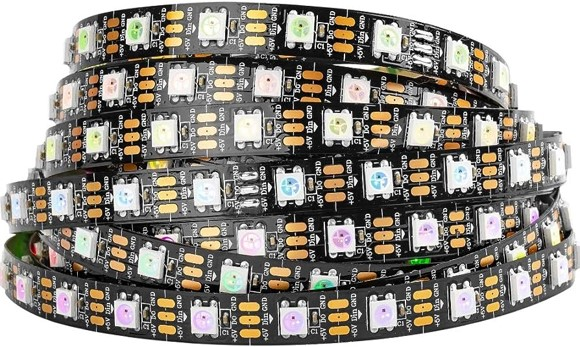
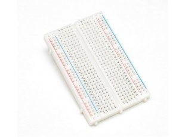
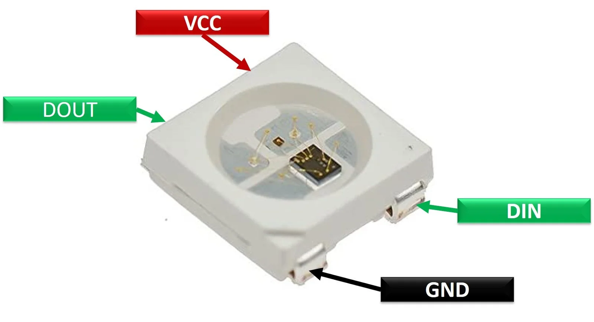

### Controlling a WS2812B LED Strip with Arduino



#### Introduction:
Up until now, we have been working with the Arduino and its built-in LED. While this has been great for understanding the basics, it is time to transition to something more visually appealing: using an external WS2812B LED strip. This guide will help you move beyond the Arduino's onboard LED to control a vibrant and colorful LED strip. We will also introduce the use of breadboards to facilitate our circuit connections. 

First, we'll use an example sketch from the FastLED library to get the LEDs up and running quickly. After that, we'll perform some simple adaptations and finally, create a sine wave animation for the LED strip.

#### 1. **Gather Necessary Components:**
   - **Arduino Board:** (e.g., Arduino Nano).
   - **Cable:** mini-USB to USB.
   - **WS2812B LED Strip:** Ensure it has 8 LEDs.
   - **Connecting Wires:** Jumper wires for connections.
   - **Breadboard,** for prototyping.

#### Breadboards



#### **1. Purpose:**
   - Used for prototyping electronic circuits without soldering.

#### **2. Structure:**
   - **Rows and Columns:**
     - Consist of a grid of holes arranged in rows and columns.
   - **Metal Strips:**
     - Metal strips underneath the board connect the holes electrically.

#### **3. Power Rails:**
   - **Lines:**
     - Two long rows typically run along the top and bottom for power distribution.
   - **Purpose:**
     - Used to connect power supply (positive and negative).

#### **4. Terminal Strips:**
   - **Rows:**
     - Consist of short horizontal rows in the middle.
   - **Connections:**
     - Each row of five holes is electrically connected, allowing components to be inserted and interconnected.

#### **5. Component Placement:**
   - **Insertion:**
     - Components like resistors, capacitors, and ICs are inserted into the holes.
   - **Connections:**
     - Wires or jumper cables are used to connect different components.

#### **6. Integration:**
   - **Circuits:**
     - Allows easy creation and modification of circuits.
   - **Testing:**
     - Facilitates testing and troubleshooting before finalizing designs.

#### **7. Advantages:**
   - **Non-permanent:**
     - Components can be easily removed or replaced.
   - **Reusable:**
     - Breadboards can be reused for multiple projects.

#### **8. Common Uses:**
   - Ideal for learning, prototyping, and debugging electronic circuits.

------------------------------------------



#### 2. **Circuit Connections:**
   - **Power Connections:**
     - Connect the 5V and GND of the power supply to the LED strip.
   - **Data Connection:**
     - Connect the Data Input (DIN) of the LED strip to a digital pin on the Arduino (e.g., pin 6).
   - **Arduino Power:**
     - Connect the Arduino to your computer via USB

   **Basic Wiring Diagram:**
```
Arduino          WS2812B LED Strip
5V  ------------  5V
GND ------------  GND
Pin 6 ----------  DIN
```

#### 3. **Install Necessary Library:**
   - **FastLED Library:**
     - Open Arduino IDE.
     - Navigate to `Sketch` > `Include Library` > `Manage Libraries`.
     - Search for "FastLED" and install the library.

#### 4. **Use Example Sketch:**
   - **Open Example:**
     - Go to `File` > `Examples` > `FastLED` > `DemoReel100`.
   - **Modify the Example:**
     - Change the number of LEDs and the type of LED strip in the example code.
```cpp
#define LED_PIN     6
#define NUM_LEDS    8
#define LED_TYPE    WS2812B
#define COLOR_ORDER GRB
CRGB leds[NUM_LEDS];

void setup() {
  FastLED.addLeds<LED_TYPE, LED_PIN, COLOR_ORDER>(leds, NUM_LEDS).setCorrection(TypicalLEDStrip);
}

void loop() {
  // Existing code for animations
}
```
   - **Upload to Arduino:**
     - Click the `Upload` button to upload the modified example code to the Arduino.
   - **Observe the LED Strip:**
     - The LED strip will display various pre-programmed patterns, demonstrating the capabilities of the FastLED library.

#### 5. **Experiment with Other Animations:**
   - Try modifying the example sketch or creating new sketches to see how different animations affect the LED strip. Some simple ideas include changing colors, speed, or creating new patterns.

#### 6. **Adapt an Example Code:**
   - **Simple Adaptation:**
     - Open the `ColorPalette` example from the FastLED library.
     - Modify the colors in the color palette to create a custom sequence.
     - Upload the modified code to the Arduino to see the changes in the LED strip.
   - **Code Example:**
```cpp
#include <FastLED.h>

#define LED_PIN 6
#define NUM_LEDS 8

CRGB leds[NUM_LEDS];

void setup() {
  FastLED.addLeds<NEOPIXEL, LED_PIN>(leds, NUM_LEDS);
}

void loop() {
  fill_solid(leds, NUM_LEDS, CRGB::Red);
  FastLED.show();
  delay(500);
  fill_solid(leds, NUM_LEDS, CRGB::Green);
  FastLED.show();
  delay(500);
  fill_solid(leds, NUM_LEDS, CRGB::Blue);
  FastLED.show();
  delay(500);
}
```

#### 7. **Create a Sine Wave Animation:**
   - **Use a Sine Wave:**
     - Create a function to generate a sine wave pattern across the 8 LEDs.
   - **Code Example:**
```cpp
// Include the FastLED library
#include <FastLED.h>
// Include the math library to use the sin() function
#include <math.h>

// Define the pin that is connected to the DIN of the LED strip
#define LED_PIN 6

// Define the number of LEDs in the strip
#define NUM_LEDS 8

// Create an array of LED objects
CRGB leds[NUM_LEDS];

// Declare a variable to keep track of the angle
float angle = 0.0;

void setup() {
  // Initialize the LED strip
  FastLED.addLeds<NEOPIXEL, LED_PIN>(leds, NUM_LEDS);
  FastLED.clear();
  FastLED.show(); // Initialize all pixels to 'off'
}

void loop() {
  // Calculate the sine of the angle for each LED and set its brightness
  for (int i = 0; i < NUM_LEDS; i++) {
    int brightness = (sin(angle + (i * PI / 4)) + 1) * 127.5; // Scale sine wave result to 0-255
    leds[i] = CHSV(0, 0, brightness);
  }

  // Increment the angle
  angle += 0.1;

  // Reset the angle if it exceeds 2*PI
  if (angle > TWO_PI) {
    angle = 0;
  }

  // Show the updated LED colors
  FastLED.show();

  // Wait for 100 milliseconds before the next loop
  delay(100);
}
```

With these steps, you should be able to control the WS2812B LED strip using an Arduino, experiment with various animations, and even create a sine wave pattern. Happy coding!